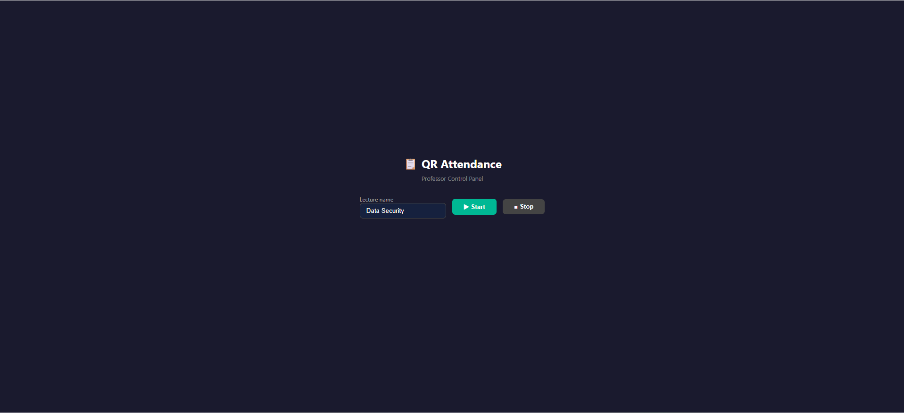
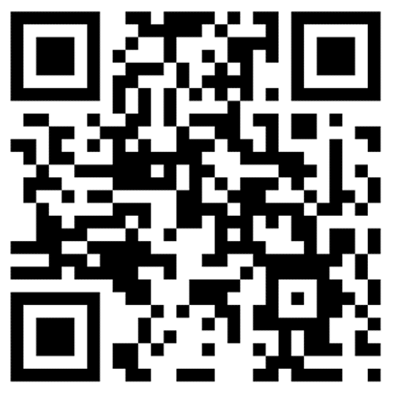
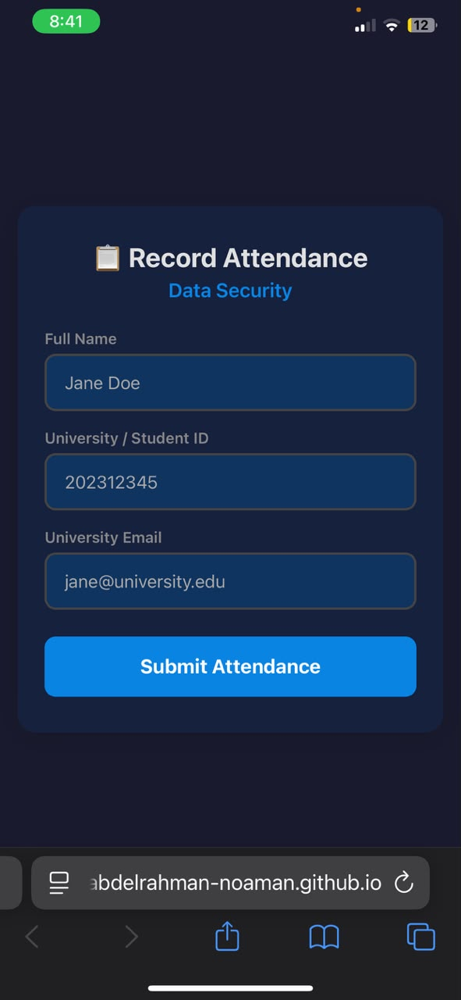
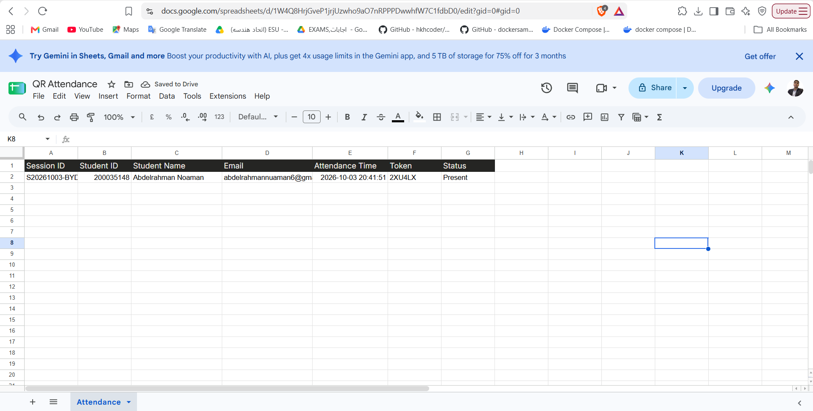
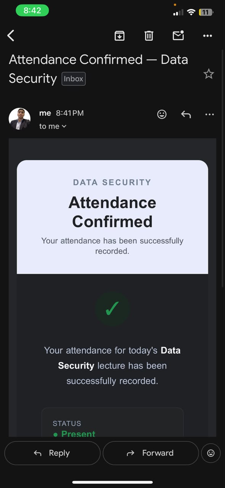
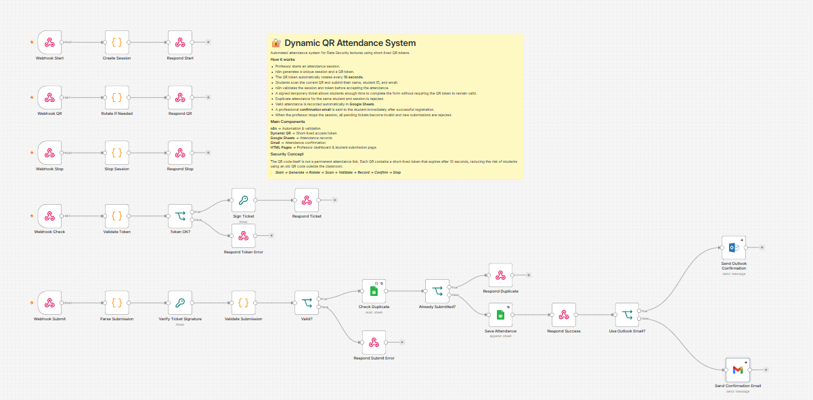

# 🔐 Dynamic QR Attendance System

<p align="center">
  <strong>Attendance that expires before it can be reused.</strong>
  <br><br>
  A short-lived, token-based attendance system built with
  <strong>n8n</strong>, <strong>Webhooks</strong>, and
  <strong>Google Workspace</strong>.
</p>

<p align="center">
  <a href="https://youtu.be/mqqjV_AJU3U">
    
  </a>
  
  
  
  
</p>

---

## 📑 Table of Contents

- [Demo](#-demo)
- [Overview](#-overview)
- [The Problem](#-the-problem)
- [The Idea](#-the-idea)
- [Key Features](#-key-features)
- [How It Works](#-how-it-works)
- [System Demo](#-system-demo)
- [n8n Workflow](#️-n8n-workflow)
- [Architecture](#️-architecture)
- [Tech Stack](#️-tech-stack)
- [Repository Structure](#-repository-structure)
- [Setup](#-setup)
- [Validation Scenarios](#-validation-scenarios)
- [Known Limitations](#️-known-limitations)
- [Future Improvements](#-future-improvements)
- [What I Learned](#-what-i-learned)
- [Documentation](#-documentation)
- [Author](#-author)

---

## 🎥 Demo

<p align="center">
  <a href="https://youtu.be/mqqjV_AJU3U">
    
  </a>
</p>

<p align="center">
  <strong>▶ Watch the project walkthrough</strong>
  <br>
  Problem → Live Demo → n8n Workflow
</p>

---

## ✨ Overview

Traditional QR attendance relies on a static QR code that remains valid for the duration of the attendance session.

That creates a simple problem:

> **A student can screenshot the QR code and share it with someone who is not attending.**

This project explores a lightweight alternative:

> **What if the QR code itself expired before it could be reused?**

The system generates **short-lived QR tokens** that rotate approximately every **10 seconds**.

When a student scans the QR:

1. n8n validates the session and token.
2. A temporary **HMAC-SHA256 signed ticket** is issued.
3. The student gets a limited window to complete the attendance form.
4. The final submission is validated again.
5. Duplicate attendance is rejected.
6. Valid attendance is recorded in Google Sheets.
7. A confirmation email is sent automatically through Gmail.

This is primarily an **automation and software engineering project**, demonstrating:

- Workflow orchestration
- Webhook design
- Temporary state management
- Token validation
- Cryptographic signing
- API integration
- Duplicate prevention
- Google Workspace automation
- Lightweight frontend/backend integration

---

## 🎯 The Problem

A typical static QR attendance flow looks like this:

```text
Professor
    │
    ▼
Static QR Code
    │
    ▼
Student scans
    │
    ▼
Google Form
    │
    ▼
Attendance recorded
```

The QR itself does not change.

Therefore, a screenshot of the QR remains useful for as long as the attendance session is active.

The goal of this project was **not** to build a massive attendance platform. The goal was to introduce a small, meaningful security improvement using **short-lived access tokens** and **server-side validation**.

---

## 💡 The Idea

Instead of keeping one QR code active for the whole lecture:

```text
┌─────────────────────────────┐
│       STATIC QR CODE        │
│                             │
│     Valid for the lecture   │
└─────────────────────────────┘
```

the system continuously rotates the underlying token:

```text
TOKEN #1
   │
   ├── Valid ~10 seconds
   ▼
TOKEN #2
   │
   ├── Valid ~10 seconds
   ▼
TOKEN #3
   │
   ├── Valid ~10 seconds
   ▼
TOKEN #4
   │
   └── ...
```

The important part is that **expiration is enforced by the backend**, not just by the browser.

> The browser displays the QR.  
> n8n decides whether the QR is valid.

---

## ⚡ Key Features

| Feature | Description |
|---|---|
| 🔄 **Dynamic QR** | QR tokens rotate approximately every 10 seconds |
| ⏱️ **Short-lived tokens** | Expired tokens are rejected by the backend |
| 🔐 **Signed tickets** | HMAC-SHA256 protects temporary attendance tickets |
| 🛡️ **Server-side validation** | The browser is never trusted |
| 🚫 **Duplicate prevention** | The same student cannot register twice in one session |
| 📊 **Google Sheets** | Attendance records are stored automatically |
| 📧 **Gmail confirmation** | Successful attendance triggers an email |
| 🛑 **Session control** | Stopping a session invalidates pending attendance |
| ⚙️ **n8n orchestration** | Backend logic and integrations are handled through n8n |

---

## 🔄 How It Works

### 🔐 Security Model

The system uses multiple validation layers rather than trusting the QR code alone.

#### 1. Short-Lived QR Token

Each QR token is valid for approximately 10 seconds.

```text
Issued:  12:30:00
Expires: 12:30:10

12:30:05  ✅ Valid
12:30:09  ✅ Valid
12:30:11  ❌ Expired
```

- The `/dqr-qr` endpoint rotates the active token when it expires.
- The `/dqr-check` endpoint independently verifies the token timestamp, so an old QR cannot be accepted just because it was previously valid.

#### 2. Session Validation

A token must belong to the **currently active** attendance session.

The system maintains session state containing:

- Session ID
- Active status
- Current token
- Token issue time
- Lecture information

#### 3. Signed Temporary Ticket

After a valid QR scan, n8n generates a temporary ticket.

```text
Session ID
     +
Token
     +
Expiration
     │
     ▼
HMAC-SHA256
     │
     ▼
Signed Ticket
```

The ticket is valid for approximately **3 minutes**.

This gives the student enough time to complete the form **without** keeping the QR token itself valid for the entire submission period.

#### 4. Final Submission Validation

The final submission is validated again before attendance is recorded. The system checks:

- Ticket signature
- Ticket expiration
- Session ID
- Active session
- Required fields
- Basic email format
- Duplicate attendance

#### 5. Duplicate Prevention

Before inserting a record, the workflow checks the combination of:

```text
(Session ID + Student ID) OR (Session ID + Device ID)
```

This prevents the same student or browser from registering multiple times
during the same attendance session. The device ID is stored in browser storage,
so it is an additional control rather than a guaranteed hardware identifier.

#### 6. Session Stop

When the professor stops the session:

```text
Active Session
      │
      ▼
    STOP
      │
      ▼
Session inactive
      │
      ├── New scans        → ❌ Rejected
      │
      └── Pending tickets  → ❌ Invalid
```

---

## 🎬 System Demo

### 👨‍🏫 Professor Dashboard

The professor dashboard allows the instructor to:

- Start an attendance session
- Display the current QR code
- Monitor the token countdown
- Stop the attendance session

<!-- TODO: Add docs/images/professor-dashboard.png -->
<p align="center">
  
</p>

### 🔄 Dynamic QR Rotation

The QR code automatically changes as the current token expires. This is the core behavior of the system.

<!-- TODO: Add docs/gifs/qr-rotation.gif showing at least two QR rotations -->
<p align="center">
  
</p>

### 👨‍🎓 Student Attendance

After scanning the current QR, the student is taken to the attendance page.

The scan is validated **before** the student receives a temporary signed ticket.

<!-- TODO: Add docs/images/student-attendance.png -->
<p align="center">
  
</p>

### 📊 Attendance Recording

Once the submission passes validation, n8n records the attendance in Google Sheets.

<!-- TODO: Add docs/images/google-sheets.png. Use synthetic test data. -->
<p align="center">
  
</p>

Example row format:

```text
Session ID | Student ID | Device ID | Student Name | Email | Attendance Time | Token | Status
```

### 📧 Confirmation Email

After successful attendance recording, Gmail automatically sends a confirmation message.

<!-- TODO: Add docs/images/gmail-confirmation.png. Blur any real email addresses. -->
<p align="center">
  
</p>

---

## ⚙️ n8n Workflow

The backend is orchestrated through a single n8n workflow containing the session, QR, validation, attendance, and notification logic.

<!-- TODO: Add docs/images/n8n-workflow.png -->
<p align="center">
  
</p>

The workflow exposes five main endpoints:

| Endpoint | Method | Purpose |
|---|---|---|
| `/dqr-start` | `POST` | Start an attendance session |
| `/dqr-qr` | `GET` | Return or rotate the current token |
| `/dqr-stop` | `POST` | Stop the active session |
| `/dqr-check` | `GET` | Validate a QR scan and issue a ticket |
| `/dqr-submit` | `POST` | Validate the ticket and record attendance |

### 🧠 Behind the Scenes

The complete flow can be summarized as:

```text
START
  │
  ▼
Create Session
  │
  ▼
Generate Token
  │
  ▼
Rotate Every ~10 Seconds
  │
  ▼
Student Scans
  │
  ▼
Validate Session + Token
  │
  ▼
Generate Signed Ticket
  │
  ▼
Student Submits
  │
  ▼
Validate Ticket
  │
  ▼
Check Duplicate
  │
  ▼
Google Sheets
  │
  ▼
Gmail Confirmation
```

The interesting engineering work is not simply connecting Google Sheets and Gmail. The workflow has to **maintain temporary state**, **validate multiple stages** of the request, **handle expiration**, and **reject invalid or duplicate submissions**.

---

## 🏗️ Architecture

```text
┌──────────────────────┐          ┌──────────────────────┐
│  Professor Dashboard │          │     Student Page     │
│  (HTML / JS / QR.js) │          │     (HTML / JS)      │
└──────────┬───────────┘          └──────────┬───────────┘
           │  /dqr-start  /dqr-qr  /dqr-stop │  /dqr-check  /dqr-submit
           └───────────────┬─────────────────┘
                           ▼
                 ┌───────────────────┐
                 │        n8n         │
                 │ Webhooks + Code   │
                 │ Session State     │
                 │ HMAC Signing      │
                 │ Validation        │
                 └────────┬──────────┘
                          │
            ┌─────────────┴─────────────┐
            ▼                           ▼
   ┌────────────────┐          ┌────────────────┐
   │ Google Sheets  │          │     Gmail      │
   │ (Attendance)   │          │ (Confirmation) │
   └────────────────┘          └────────────────┘
```

### 🧩 Main Components

**⚙️ n8n** — The central automation and orchestration layer. Responsible for HTTP webhooks, session state, token generation and validation, HMAC signing, ticket validation, duplicate detection, Google Workspace integrations, and email automation.

**🖥️ Professor Dashboard** — A lightweight HTML/CSS/JavaScript interface used to start sessions, display the dynamic QR, show token expiration, and stop sessions.

**📱 Student Page** — The student-facing interface used to validate a QR scan, receive a temporary ticket, and submit attendance information.

**📊 Google Sheets** — Used as the prototype attendance data store.

**📧 Gmail** — Used to send confirmation emails after successful attendance.

**🔳 QRCode.js** — Used by the professor dashboard to render the current QR token.

---

## 🛠️ Tech Stack

| Layer | Technologies |
|---|---|
| **Automation & Backend** | n8n · HTTP Webhooks · Workflow Static Data · JavaScript Code Nodes |
| **Frontend** | HTML · CSS · Vanilla JavaScript · QRCode.js |
| **Google Workspace** | Google Sheets API · Gmail API · OAuth2 |
| **Security** | HMAC-SHA256 · Short-lived tokens · Signed tickets · Server-side validation · Session-based access control |

---

## 📁 Repository Structure

```text
dynamic-qr-attendance/
│
├── README.md
├── .gitignore
│
├── n8n/
│   └── dynamic-qr-attendance.json
│
├── frontend/
│   ├── professor-dashboard.html
│   └── student-attendance.html
│
└── docs/
    │
    ├── architecture.md
    ├── workflow.md
    │
    ├── images/
    │   ├── professor-dashboard.png
    │   ├── student-attendance.png
    │   ├── google-sheets.png
    │   ├── gmail-confirmation.png
    │   └── n8n-workflow.png
    │
    └── gifs/
        └── qr-rotation.gif
```

---

## 🚀 Setup

### 1. Import the n8n Workflow

Import `n8n/dynamic-qr-attendance.json` into your n8n instance.

Attach your own:

- Google Sheets OAuth2 credentials
- Gmail OAuth2 credentials

### 2. Configure Private Values

Replace the following placeholders inside the imported workflow:

```text
REPLACE_WITH_PROF_KEY
REPLACE_WITH_SIGN_SECRET
YOUR_GOOGLE_SHEET_ID
```

Use long, random values for `PROF_KEY` and `SIGN_SECRET`.

> ⚠️ **Important**  
> Do not commit a configured workflow export containing real secrets. The repository should contain only the sanitized, public version.

### 3. Configure the Frontend

Update the n8n **production** webhook base URL inside:

```text
frontend/professor-dashboard.html
frontend/student-attendance.html
```

Also configure the student page URL used inside the professor dashboard.

Open the professor page using:

```text
professor-dashboard.html?key=YOUR_PROF_KEY
```

> Use production webhook URLs when testing the complete flow. Workflow state needs to persist in the active workflow, which test URLs do not provide.

### 4. Prepare Google Sheets

Create a spreadsheet containing an `Attendance` sheet with the following headers:

```text
Session ID | Student ID | Device ID | Student Name | Email | Attendance Time | Token | Status
```

If student IDs can contain leading zeros, format the **Student ID** column as **Plain text**.

### 5. Activate and Test

Activate the n8n workflow and test the complete flow:

```text
Start Session
      ↓
QR appears
      ↓
QR rotates
      ↓
Scan current QR
      ↓
Submit student information
      ↓
Google Sheets
      ↓
Gmail confirmation
```

Use synthetic test data during development.

---

## 🧪 Validation Scenarios

The system should be tested against both successful and invalid flows.

| Scenario | Expected Result |
|---|---|
| Current QR scanned | ✅ Accepted |
| Expired QR scanned | ❌ Rejected |
| Invalid session | ❌ Rejected |
| Invalid ticket | ❌ Rejected |
| Expired ticket | ❌ Rejected |
| Duplicate Student ID | ❌ Rejected |
| Missing required field | ❌ Rejected |
| Session stopped | ❌ New submissions rejected |
| Valid submission | ✅ Recorded in Google Sheets |
| Valid submission | 📧 Confirmation email sent |

---

## ⚠️ Known Limitations

This system improves the security properties of static QR attendance, but it **does not prove physical presence**. A valid QR can still be relayed to another person during its short lifetime.

The current prototype also has several intentional limitations:

- One active session in the workflow state model
- Shared professor key
- Wildcard webhook origins
- Google Sheets instead of a transactional database
- Basic email syntax validation
- No university-domain enforcement
- No dedicated production secrets manager
- n8n workflow static data for session state
- No strong physical-presence verification

These limitations are documented because the project is intended as a **practical prototype**, not a production attendance platform.

---

## 🔮 Future Improvements

- 🎓 University identity authentication
- 📧 University-domain email verification
- 🗄️ Database-backed session state
- 👥 Role-based professor accounts
- 🚦 Rate limiting
- 📋 More detailed audit logging
- 🔁 Stronger replay protection
- 🔐 Production secrets management
- 📱 Improved mobile experience
- 📍 Additional physical-presence verification

---

## 📚 What I Learned

This project provided practical experience with:

- Event-driven workflow design
- HTTP webhook architecture
- Temporary session state
- Short-lived access tokens
- HMAC-SHA256 signing
- Server-side validation
- Duplicate/replay prevention concepts
- Google Workspace APIs
- OAuth2 integrations
- Automated email workflows
- Connecting browser interfaces to backend automation
- Designing validation and failure paths

One of the main lessons:

> Automation is not just about connecting APIs.  
> The more interesting engineering challenge is designing the state, validation, expiration, security boundaries, and failure cases **between** those services.

---

## 🎥 Project Walkthrough

The walkthrough covers the project problem, a live system demo, and the n8n workflow.

```text
00:00 — Problem & Idea
01:00 — Live System Demo
02:00 — n8n Workflow & Engineering
03:00 — End
```

<p align="center">
  <a href="https://youtu.be/mqqjV_AJU3U">
    
  </a>
</p>

---

## 📄 Documentation

- [Workflow Details](docs/workflow.md)
- [Architecture](docs/architecture.md)
- [n8n Workflow Export](n8n/dynamic-qr-attendance.json)

---

## 👤 Author

<p align="center">
  <strong>Abdelrahman Noaman</strong>
  <br>
  Computer & Software Engineering Student
  <br>
  MUST — Misr University for Science & Technology
  <br><br>
  <a href="https://github.com/Abdelrahman-Noaman">
    
  </a>
</p>

---

<p align="center">
  <strong>Built with n8n • Webhooks • JavaScript • Google Sheets • Gmail</strong>
  <br><br>
  <sub>A practical experiment in workflow automation, short-lived tokens, and lightweight security.</sub>
</p>
