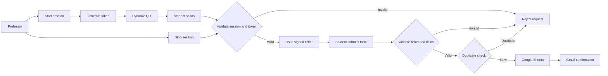

# Dynamic QR Attendance System

<p align="center">
  <strong>Attendance that expires before it can be reused.</strong><br>
  A short-lived, token-based attendance workflow built with <strong>n8n</strong>, webhooks, and Google Workspace.
</p>

This is an automation and software engineering project rather than an AI model project. It demonstrates workflow orchestration, API integration, temporary state management, server-side validation, cryptographic signing, and browser-to-workflow integration.

## Recruiter-Focused Summary

The project addresses a practical weakness in static QR attendance: a student can screenshot and share a QR code while the session is active. The system reduces that window by rotating the QR token every 10 seconds, validating scans in n8n, issuing a three-minute HMAC-SHA256 ticket, and validating the final submission before recording attendance.

The implementation shows how a lightweight frontend can work with an automation backend to coordinate state, expiration, failure paths, persistence, and email notification without introducing a framework that the project does not need.

## Problem and Solution

A static classroom QR code remains useful for too long. A shared screenshot may allow someone outside the classroom to submit attendance.

This project replaces the permanent QR with a short-lived token. The browser displays the QR, but n8n remains responsible for deciding whether the session, token, ticket, and submission are valid.

## How It Works



## Key Features

| Feature | Behavior |
| --- | --- |
| Dynamic QR | The dashboard refreshes the token approximately every 10 seconds. |
| Short-lived access | Expired tokens are rejected by the workflow. |
| Signed tickets | A valid scan receives an HMAC-SHA256 ticket that expires after three minutes. |
| Server-side validation | The browser is treated as untrusted input. |
| Duplicate prevention | The workflow rejects an existing `(Session ID, Student ID)` pair. |
| Session control | Starting and stopping attendance is controlled by protected professor endpoints. |
| Google Sheets | Successful attendance is stored in the `Attendance` sheet. |
| Gmail confirmation | A confirmation email is sent after attendance is recorded. |

## Security Model

1. The professor endpoints require a shared professor key.
2. The active QR token is replaced after 10 seconds.
3. `/dqr-check` verifies the active session, session ID, token, and token age.
4. A valid scan receives a ticket containing the session ID, token, expiry timestamp, and HMAC-SHA256 signature.
5. `/dqr-submit` recomputes the signature and verifies ticket expiry, active session, required fields, and basic email format.
6. Google Sheets is checked before a new attendance row is appended.
7. Stopping the session makes new scans and pending tickets invalid.

The public workflow export contains placeholders instead of private secrets, OAuth credentials, private webhook URLs, or a real spreadsheet ID.

## n8n Workflow

The backend is exported in [n8n/dynamic-qr-attendance.json](n8n/dynamic-qr-attendance.json). The full stage-by-stage behavior is documented in [docs/workflow.md](docs/workflow.md), with component responsibilities and trust boundaries described in [docs/architecture.md](docs/architecture.md).

| Endpoint | Method | Purpose |
| --- | --- | --- |
| `/dqr-start` | POST | Create the active attendance session. |
| `/dqr-qr` | GET | Return the current token or rotate it. |
| `/dqr-stop` | POST | Close the active session. |
| `/dqr-check` | GET | Validate a QR scan and issue a ticket. |
| `/dqr-submit` | POST | Validate a ticket and record attendance. |

## Main Components

| Component | Responsibility |
| --- | --- |
| n8n | Webhooks, workflow static state, validation, signing, duplicate checks, and integrations. |
| Professor dashboard | Starts/stops sessions, polls the QR, renders it with QRCode.js, and shows the countdown. |
| Student page | Reads the QR parameters, validates the scan, and submits student details. |
| Google Sheets | Prototype attendance store and duplicate lookup. |
| Gmail | Confirmation email after a successful record. |

## Technology Stack

- n8n workflow automation
- HTTP webhooks
- HTML, CSS, and vanilla JavaScript
- QRCode.js
- Google Sheets OAuth2 integration
- Gmail OAuth2 integration
- HMAC-SHA256 signed tickets

## Repository Structure

```text
.
├── README.md
├── .gitignore
├── n8n/
│   └── dynamic-qr-attendance.json
├── frontend/
│   ├── professor-dashboard.html
│   └── student-attendance.html
└── docs/
    ├── architecture.md
    └── workflow.md
```

## Setup

### 1. Import the workflow

Import [n8n/dynamic-qr-attendance.json](n8n/dynamic-qr-attendance.json) into n8n. Attach your own Google Sheets OAuth2 and Gmail OAuth2 credentials to the relevant nodes.

### 2. Configure private values

Replace these placeholders in the imported workflow before activation:

```text
REPLACE_WITH_PROF_KEY
REPLACE_WITH_SIGN_SECRET
YOUR_GOOGLE_SHEET_ID
```

Use long random values for the professor key and signing secret. Never commit the configured export.

### 3. Configure the frontend

Update the `N8N` constant in [frontend/professor-dashboard.html](frontend/professor-dashboard.html) and [frontend/student-attendance.html](frontend/student-attendance.html) with your n8n production webhook base URL. Update `STUDENT_URL` in the professor dashboard to the deployed student page URL.

Open the professor page with the configured key:

```text
professor-dashboard.html?key=YOUR_PROF_KEY
```

Use production webhook URLs when testing the complete workflow because session state is stored in the active n8n workflow.

### 4. Prepare Google Sheets

Create an `Attendance` sheet with these headers:

```text
Session ID | Student ID | Student Name | Email | Attendance Time | Token | Status
```

Format the Student ID column as plain text if leading zeros must be preserved.

### 5. Activate and test

Use synthetic test data and verify these steps in order:

```text
Start session -> QR appears -> QR rotates -> scan current QR
-> submit form -> Google Sheets row -> Gmail confirmation
```

## Validation Scenarios

| Scenario | Expected result |
| --- | --- |
| Current QR scanned | Accepted and ticket issued. |
| Expired QR scanned | Rejected with `TOKEN_EXPIRED` or `TOKEN_INVALID`. |
| Invalid session | Rejected. |
| Invalid or expired ticket | Rejected. |
| Duplicate Student ID in the session | Rejected with `DUPLICATE`. |
| Missing required field | Rejected. |
| Invalid email shape | Rejected. |
| Session stopped | New scans and pending submissions rejected. |
| Valid submission | Recorded and followed by a confirmation email attempt. |

## Known Limitations

Rotating QR tokens reduce the usefulness of screenshots but do not prove physical presence. A valid QR can still be relayed during its short lifetime.

The current prototype also has these deliberate limitations:

- One active session in the workflow static state model
- Shared professor key rather than individual accounts
- Wildcard webhook origins in the exported workflow
- Google Sheets instead of a transactional database
- Basic email syntax validation without university-domain enforcement
- No dedicated production secrets manager
- No strong physical-presence verification

## Future Improvements

- University identity authentication and role-based professor access
- University-domain email verification
- Rate limiting and stronger abuse monitoring
- Database-backed shared session state
- More detailed audit logging
- Stronger replay protection
- Production-grade secrets management
- Additional physical-presence verification

## What I Learned

This project provided practical experience with event-driven workflow design, HTTP webhooks, temporary session state, short-lived access tokens, HMAC signing, API integrations, Google Workspace automation, and validation failure paths.

The central lesson was that automation is not only about connecting APIs. The important engineering work is defining state, expiration, trust boundaries, validation order, and the behavior of failure cases.

## Demo

A public demo video can be added here when available:

`YOUR_DEMO_VIDEO_URL`

Recommended demo sequence:

```text
Problem and idea -> Professor dashboard -> QR rotation
-> Student submission -> Google Sheets -> Gmail -> n8n workflow
```

## Documentation

- [Architecture](docs/architecture.md)
- [Workflow details](docs/workflow.md)
- [n8n workflow export](n8n/dynamic-qr-attendance.json)

## Author

**Abdelrahman Noaman**  
Computer and Software Engineering Student, MUST  
[GitHub: Abdelrahman-Noaman](https://github.com/Abdelrahman-Noaman)

## Suggested Repository Description

> Dynamic QR attendance system built with n8n using short-lived tokens, validation, Google Sheets, and automated email confirmation.
