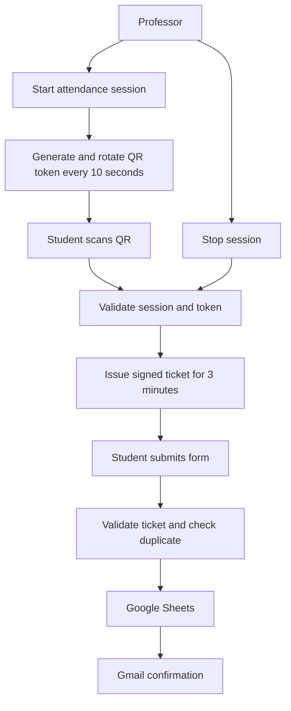

# Dynamic QR Attendance System

> A short-lived, token-based attendance workflow built with n8n to reduce the abuse of static QR attendance.

This is an automation and software engineering project, not an AI model project. It demonstrates workflow orchestration, webhooks, API integration, state management, validation, cryptographic signing, and Google Workspace automation.

## Problem

A static classroom QR code can be screenshotted and shared with someone who is not attending. The shared image remains useful until the code or attendance session changes.

## Solution

The professor starts a session that displays a QR code containing a token valid for approximately 10 seconds. A student scan is checked by n8n. If valid, n8n issues a signed ticket that gives the student three minutes to complete the form. The final submission is verified again before it is written to Google Sheets and confirmed by Gmail.

## How It Works



## Main Components

| Component | Responsibility |
| --- | --- |
| n8n | Webhooks, session state, token validation, ticket signing, duplicate checks, and integrations |
| Professor dashboard | Starts/stops sessions, polls the current QR, and shows the countdown |
| Student page | Validates a scan and submits student details |
| Google Sheets | Prototype attendance store and duplicate lookup |
| Gmail | Confirmation email after a successful record |
| QRCode.js | Renders the QR code in the professor page |

## Security and Validation

1. The professor endpoints require a shared key.
2. The active token is replaced after 10 seconds.
3. A scan must match the active session and token.
4. The student ticket is HMAC-SHA256 signed and expires after three minutes.
5. Submission validation checks the signature, expiry, active session, required fields, and basic email format.
6. Google Sheets checks `(Session ID, Student ID)` before inserting a row.
7. Stopping a session invalidates new scans and pending tickets.

The browser is not trusted. The public export contains placeholders instead of secrets, credentials, private webhook URLs, or a real spreadsheet ID.

## n8n Workflow

The exported workflow is in [n8n/dynamic-qr-attendance.json](n8n/dynamic-qr-attendance.json). Detailed behavior is documented in [docs/workflow.md](docs/workflow.md), and component boundaries are documented in [docs/architecture.md](docs/architecture.md).

Endpoints:

| Endpoint | Method | Purpose |
| --- | --- | --- |
| `/dqr-start` | POST | Start a session |
| `/dqr-qr` | GET | Return or rotate the current token |
| `/dqr-stop` | POST | Stop a session |
| `/dqr-check` | GET | Validate a QR scan and issue a ticket |
| `/dqr-submit` | POST | Validate and record attendance |

## Technologies

- n8n workflow automation
- HTTP webhooks
- HTML, CSS, and vanilla JavaScript
- QRCode.js
- Google Sheets OAuth2 integration
- Gmail OAuth2 integration
- HMAC-SHA256 signed tickets

## Repository Structure

```text
.
├── README.md
├── .gitignore
├── n8n/
│   └── dynamic-qr-attendance.json
├── frontend/
│   ├── professor-dashboard.html
│   └── student-attendance.html
└── docs/
    ├── architecture.md
    └── workflow.md
```

## Setup

### 1. Import the workflow

Import [n8n/dynamic-qr-attendance.json](n8n/dynamic-qr-attendance.json) into n8n. Attach your own Google Sheets OAuth2 and Gmail OAuth2 credentials to the relevant nodes.

### 2. Configure private values

Replace these placeholders inside the imported workflow with private values before activation:

```text
REPLACE_WITH_PROF_KEY
REPLACE_WITH_SIGN_SECRET
YOUR_GOOGLE_SHEET_ID
```

Use long random values for the key and signing secret. Do not commit the configured export.

### 3. Configure the frontend

Update `N8N` in both HTML files to your n8n production webhook base URL. Update `STUDENT_URL` in the professor dashboard to the deployed student page URL. The professor page is opened with a key, for example:

```text
professor-dashboard.html?key=YOUR_PROF_KEY
```

Use production webhook URLs when testing the complete workflow.

### 4. Prepare Google Sheets

Create an `Attendance` sheet with these headers:

```text
Session ID | Student ID | Student Name | Email | Attendance Time | Token | Status
```

Format Student ID as plain text if leading zeros must be preserved.

### 5. Activate and test

Activate the n8n workflow, open the professor dashboard, start a session, scan the current QR, submit test data, and verify the row and confirmation email. Use synthetic test data only.

## Example Attendance Flow

1. The professor opens the dashboard and starts a lecture session.
2. n8n creates the session and first token.
3. The dashboard refreshes the QR as the token expires.
4. A student scans the current QR.
5. n8n validates the scan and issues a temporary ticket.
6. The student submits name, student ID, and email.
7. n8n validates the ticket and rejects duplicates.
8. Google Sheets stores the new row.
9. Gmail sends the confirmation.
10. The professor stops the session.

## Known Limitations

A rotating QR reduces the usefulness of old screenshots but cannot prove physical presence. A valid QR can still be relayed during its short lifetime. The prototype also uses n8n workflow static data, a shared professor key, wildcard webhook origins, and Google Sheets rather than a transactional database.

The current workflow validates email syntax but does not enforce a university domain. It supports one active session in the workflow state model.

## Future Improvements

- University identity authentication
- Domain-specific email validation
- Rate limiting and stronger abuse monitoring
- Database-backed shared session state
- More robust audit logging
- Role-based professor access
- Replay-resistant submission handling
- Production secrets management
- Stronger physical-presence verification

## What I Learned

This project provided practical experience with event-driven workflows, webhook design, temporary session state, short-lived tokens, HMAC signing, API integrations, Google Workspace automation, and connecting lightweight browser interfaces to backend automation.

## Demo

Add a public demo video link here:

`[Watch the demo](YOUR_DEMO_VIDEO_URL)`

## Author

**Abdelrahman Noaman**  
Computer and Software Engineering Student, MUST  
GitHub: [Abdelrahman-Noaman](https://github.com/Abdelrahman-Noaman)

## Suggested Repository Description

> Dynamic QR attendance system built with n8n using short-lived tokens, validation, Google Sheets, and automated email confirmation.
