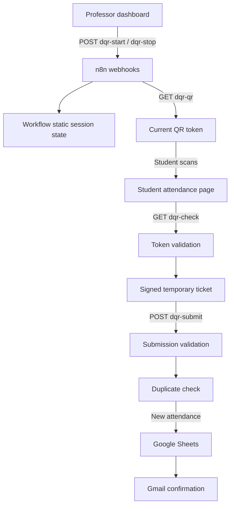

# Architecture

Dynamic QR Attendance is a small browser-to-n8n workflow. The browser interfaces are intentionally framework-free; n8n owns session state, validation, persistence, and notification.

## System Flow

## Responsibilities

### Professor dashboard

`frontend/professor-dashboard.html` starts and stops a session, polls for the current token, renders the QR code with QRCode.js, and displays the token countdown. The professor key is read from the page URL and sent to the protected professor endpoints.

### Student page

`frontend/student-attendance.html` reads the session and token from the QR URL, immediately removes them from the address bar, asks n8n to validate the scan, and submits the returned ticket with the student's form data.

### n8n

`n8n/dynamic-qr-attendance.json` exposes five webhooks:

- `POST /dqr-start`
- `GET /dqr-qr`
- `POST /dqr-stop`
- `GET /dqr-check`
- `POST /dqr-submit`

The workflow uses n8n workflow static data for the currently active session. This is appropriate for the prototype's single active session model, but it is not a substitute for a shared database in a multi-instance deployment.

### Google Sheets

The `Attendance` sheet is used both to look up an existing `(Session ID, Student ID)` pair and to append new attendance rows.

### Gmail

After the success response is prepared, the Gmail node sends a confirmation email to the submitted address. The node is configured to continue on email errors so a notification failure does not undo the recorded attendance.

## Trust Boundaries

The browser is untrusted. It can submit arbitrary form values and tickets, so the n8n workflow verifies the professor key, QR session/token, HMAC ticket signature, ticket expiry, session status, required fields, email shape, and duplicate status before writing to Sheets.

The professor key and HMAC secret are placeholders in the public export. Configure private values in the n8n workflow before activation.
